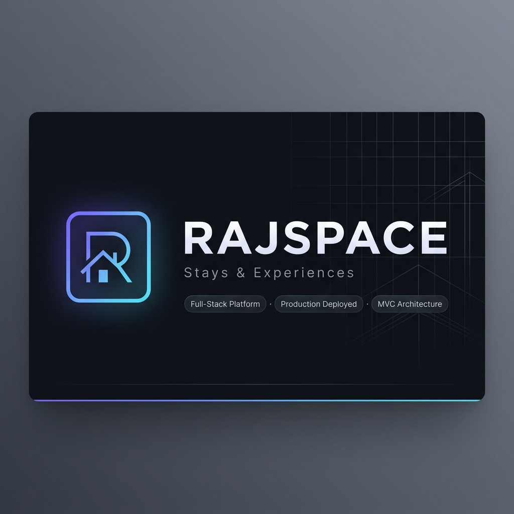
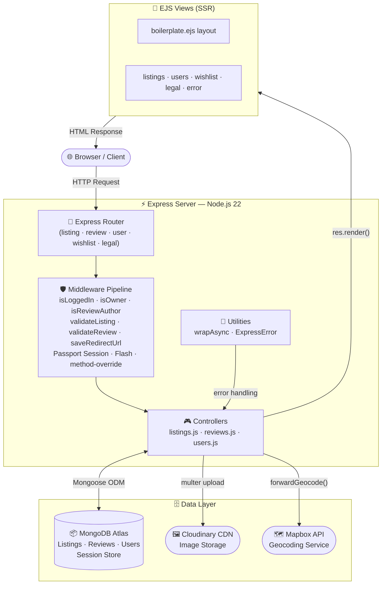
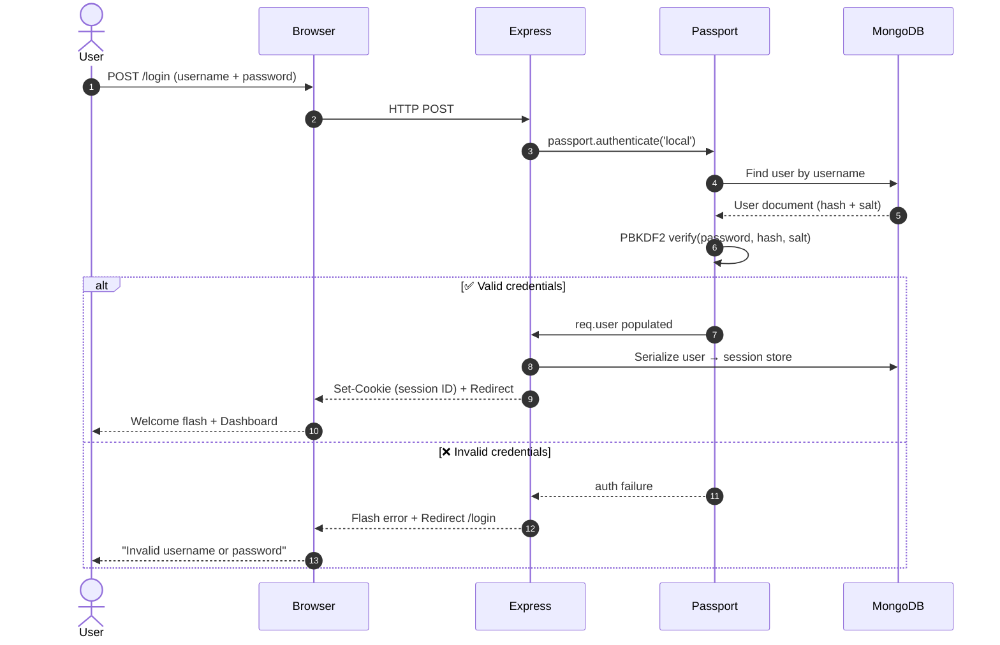
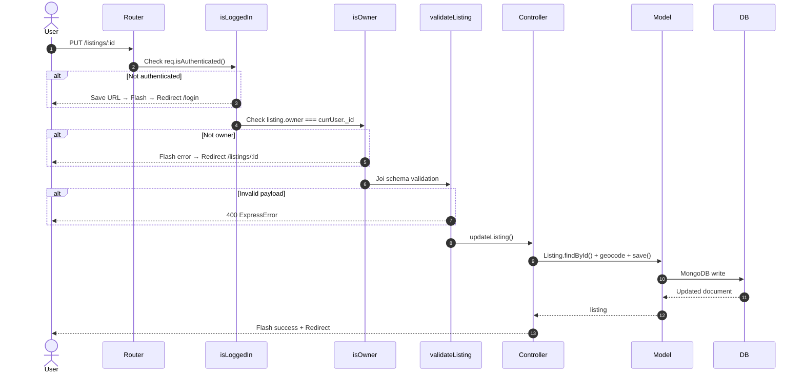
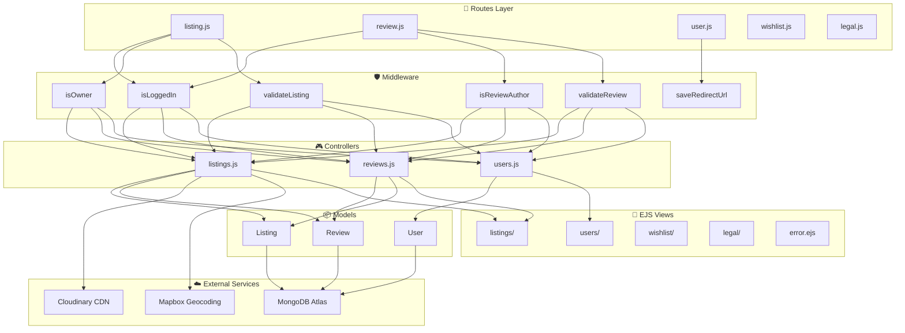
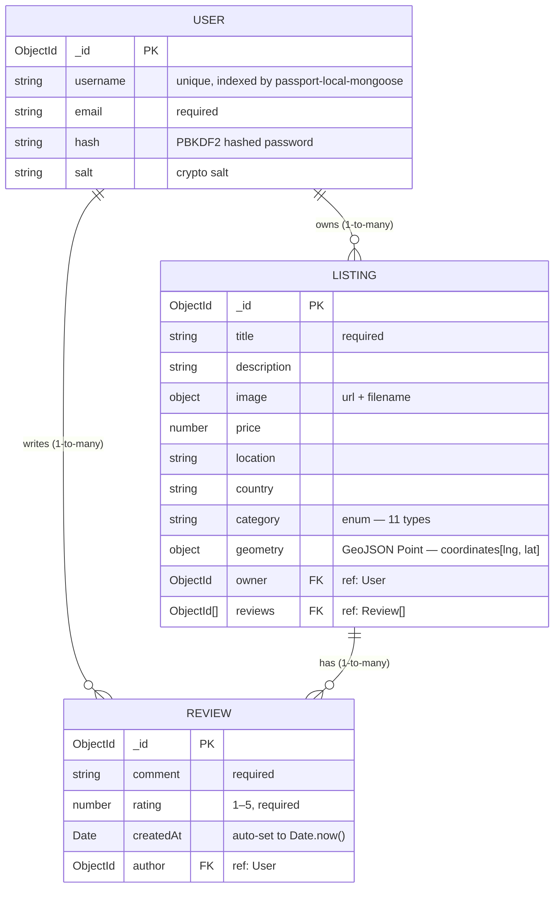

<div align="center">

<a href="https://rajspace.onrender.com">
  
</a>

<br/>

[](https://nodejs.org/)
[](https://expressjs.com/)
[](https://www.mongodb.com/)
[](https://getbootstrap.com/)
[](https://www.mapbox.com/)
[](https://cloudinary.com/)
[](http://www.passportjs.org/)
[](https://rajspace.onrender.com/)
[](LICENSE)
[](https://ejs.co/)

<br/>

[](https://rajspace.onrender.com/)
[](#-system-architecture)
[](#-api-reference)
[](#-features)
[](#-responsive-design)

<br/>

**[🌐 Live Demo](https://rajspace.onrender.com)** · **[🚀 Features](#-features)** · **[🏗 Architecture](#-system-architecture)** · **[📦 Quick Start](#-quick-start)** · **[📚 API Docs](#-api-reference)**

</div>

---

## 📑 Table of Contents

<details>
<summary><b>Click to expand full navigation</b></summary>

- [💡 Project Overview](#-project-overview)
- [🌐 Live Demo](#-live-demo)
- [📸 Screenshots](#-screenshots)
- [✨ Features](#-features)
- [🛠 Tech Stack](#-tech-stack)
- [🏗 System Architecture](#-system-architecture)
- [🗄 Database Schema](#-database-schema)
- [📂 Project Structure](#-project-structure)
- [💻 Prerequisites](#-prerequisites)
- [🚀 Quick Start](#-quick-start)
- [🔑 Environment Variables](#-environment-variables)
- [📚 API Reference](#-api-reference)
- [🔐 Authentication & Security](#-authentication--security)
- [📱 Responsive Design](#-responsive-design)
- [⚡ Performance & Optimization](#-performance--optimization)
- [☁️ Deployment](#️-deployment)
- [🗺️ Roadmap](#️-roadmap)
- [🤝 Contributing](#-contributing)
- [❓ FAQ](#-faq)
- [📄 License](#-license)
- [👨‍💻 Developer](#-developer)

</details>

---

## 💡 Project Overview

**RAJSPACE** is a **full-stack, production-deployed rental marketplace** inspired by Airbnb — engineered from the ground up to demonstrate scalable MVC architecture, secure authentication pipelines, and real-world API integrations.

Built entirely with **Node.js + Express + MongoDB**, RAJSPACE enables users to **discover** unique stays across categories, **list** their own properties with geo-tagged map pins, **review** experiences with star ratings, and **curate** a personal wishlist — all within a polished, mobile-responsive UI.

> This is not a tutorial clone. Every layer — from Joi schema validation and Passport.js session management to Cloudinary CDN image delivery and Mapbox geocoding — reflects **production engineering standards**. It is deployed live on Render with a MongoDB Atlas database and a secure, encrypted session store.

<br/>

| Property | Value |
|----------|-------|
| **Type** | Full-Stack Web Application (SaaS-style rental platform) |
| **Architecture** | Strict MVC (Model · View · Controller) |
| **Rendering** | Server-Side Rendering (EJS + ejs-mate layout engine) |
| **Auth** | Session-Based · Passport.js Local Strategy · PBKDF2 Hashing |
| **Database** | MongoDB Atlas · Mongoose ODM · Persistent MongoStore Sessions |
| **Image Delivery** | Cloudinary CDN with `multer-storage-cloudinary` |
| **Maps & Geocoding** | Mapbox GL JS + Mapbox Geocoding API |
| **Validation** | Dual-layer · Joi (server) + Bootstrap (client) |
| **Deployment** | Render (PaaS) · Node.js 22.x runtime |

---

## 🌐 Live Demo

<div align="center">

| Environment | URL | Status |
|-------------|-----|--------|
| 🟢 **Production** | [https://rajspace.onrender.com](https://rajspace.onrender.com/) | Live |
| 💻 **Local** | `http://localhost:8080` | Dev Only |

> **Seed Credentials** — After running `npm run seed`:
> Username: `rajspace-seed` · Password: `seed-pass-123`

</div>

---

## 📸 Screenshots

### 🏠 Home & Explore

<table width="100%">
  <tr>
    <td width="100%" align="center">
      
      <br/><sub><b>Home · Explore all stays with category-based filtering and live search</b></sub>
    </td>
  </tr>
</table>

<br/>

### 🗂 Category Filtering

<table width="100%">
  <tr>
    <td width="100%" align="center">
      
      <br/><sub><b>Category Filter · Scroll through Trending, Beach, Mountain, Luxury & more</b></sub>
    </td>
  </tr>
</table>

<br/>

### 🏡 Listing Detail · Map · Reviews

<table width="100%">
  <tr>
    <td width="50%" align="center">
      
      <br/><sub><b>Listing Detail · Owner info, pricing, booking button</b></sub>
    </td>
    <td width="50%" align="center">
      
      <br/><sub><b>Interactive Mapbox Map · Star Ratings · Guest Reviews</b></sub>
    </td>
  </tr>
</table>

<br/>

### 🔐 Authentication · ➕ Create Listing

<table width="100%">
  <tr>
    <td width="50%" align="center">
      
      <br/><sub><b>Login · Secure session auth with redirect preservation</b></sub>
    </td>
    <td width="50%" align="center">
      
      <br/><sub><b>Create Listing · Multi-field form with Cloudinary image upload</b></sub>
    </td>
  </tr>
</table>

---

## ✨ Features

### 🔐 Authentication & User Management

| Feature | Implementation |
|---------|----------------|
| User Registration | `POST /signup` · `passport-local-mongoose` handles salting + PBKDF2 hashing |
| Secure Login | `POST /login` · Passport Local Strategy verifies credentials |
| Session Persistence | `connect-mongo` stores sessions in MongoDB Atlas; `touchAfter: 24h` reduces writes |
| Post-Auth Redirect | `saveRedirectUrl` middleware restores the user's original destination after login |
| Graceful Logout | `GET /logout` · `req.logout()` clears session; flash confirms logout |

### 🏘 Property Listings (Full CRUD)

| Feature | Implementation |
|---------|----------------|
| Browse All Listings | `GET /listings` · Supports `?category=` and `?q=` query params |
| Full-Text Search | MongoDB `$regex` across `title`, `location`, `country`, and `category` fields |
| Category Filtering | 11 enum categories: Trending, Rooms, Entire Home, Pool, Beach, Mountain, Nature, City, Luxury, Family, Pet Friendly |
| View Listing Detail | `GET /listings/:id` · Nested `.populate()` for owner + reviews + review authors |
| Create Listing | `POST /listings` · Cloudinary image upload + Mapbox geocoding on save |
| Edit Listing | `PUT /listings/:id` · Re-geocodes location if changed; replaces image if new file uploaded |
| Delete Listing | `DELETE /listings/:id` · Mongoose post-hook cascades deletion of all linked reviews |
| Ownership Guard | `isOwner` middleware prevents unauthorized edit/delete at route level |

### 🗺 Maps & Geolocation

| Feature | Implementation |
|---------|----------------|
| Forward Geocoding | Mapbox Geocoding API converts `location` string → GeoJSON `Point` coordinates on create/edit |
| Interactive Map | Mapbox GL JS renders a dynamic, zoomable pin at listing's geocoded coordinates |
| Graceful Fallback | If Mapbox is unavailable, coordinates default to `[72.88, 19.08]` (Mumbai) |
| Null-Safe Owner | Orphaned listings display `"RAJSPACE Host"` as a fallback owner label |

### ⭐ Reviews & Ratings

| Feature | Implementation |
|---------|----------------|
| Create Review | `POST /listings/:id/reviews` · Star rating (1–5) + written comment stored in `Review` model |
| Delete Review | `DELETE /listings/:id/reviews/:reviewId` · Author-only guard via `isReviewAuthor` middleware |
| Review Analytics | Controller computes `average rating` and `review count` dynamically before rendering |
| Cascade Deletion | Mongoose `findOneAndDelete` post-hook removes all reviews when a listing is deleted |

### 💖 Wishlist

| Feature | Implementation |
|---------|----------------|
| Add to Wishlist | `POST /wishlist/:id` · Stores listing ObjectId in `req.session.wishlist` array |
| Remove from Wishlist | `DELETE /wishlist/:id` · Filters ID out of session array |
| View Wishlist | `GET /wishlist` · Queries MongoDB for all saved IDs (max 50) and renders the grid |
| Duplicate Guard | Checks for existing ID before pushing to prevent duplicate entries |

### 🖼 Image Management

| Feature | Implementation |
|---------|----------------|
| Direct-to-Cloud Uploads | `multer` + `multer-storage-cloudinary` streams uploads directly to `rajspace_dev` folder |
| Accepted Formats | PNG, JPG, JPEG only (whitelisted in CloudinaryStorage config) |
| Image Transform | URL rewritten with `/upload/w_250` in edit preview for optimized thumbnail |
| Graceful Fallback | If Cloudinary is unconfigured, uses a high-quality Unsplash placeholder image |

### 🎨 UI/UX & Design

| Feature | Details |
|---------|---------|
| Custom Teal Theme | Bootstrap 5 overridden with a curated teal/dark palette via `style.css` |
| Dark Mode Support | Optimized dark-mode compatibility for system-level preference |
| Scrollable Category Chips | Horizontally scrollable filter bar inspired by Airbnb's design language |
| Tax Price Toggle | JavaScript toggle shows/hides price-with-tax display on listing cards |
| Star Rating Component | Dedicated `rating.css` renders semantic, interactive star ratings |
| Flash Notifications | `connect-flash` surfaces success/error banners after every action |
| Verified Host Badge | Visual badge displayed on owner's listings |
| Legal Pages | `/privacy-policy` and `/terms-of-service` static routes via `legal.js` router |

---

## 🛠 Tech Stack

<details>
<summary><b>🔍 View complete dependency breakdown</b></summary>

### Backend

| Technology | Version | Role |
|------------|---------|------|
| **Node.js** | `22.x` | JavaScript runtime · Powers the server |
| **Express.js** | `^5.2.1` | Web framework · Routing · Middleware pipeline |
| **Mongoose** | `^9.1.3` | MongoDB ODM · Schema definitions · Query building |
| **MongoDB** | Atlas (cloud) | NoSQL document database · Persistent data store |
| **Passport.js** | `^0.7.0` | Authentication middleware framework |
| **passport-local** | `^1.0.0` | Username/password authentication strategy |
| **passport-local-mongoose** | `^9.0.1` | Mongoose plugin · PBKDF2 hashing · Auto user methods |
| **express-session** | `^1.18.2` | Session management middleware |
| **connect-mongo** | `^6.0.0` | MongoDB-backed session store with crypto |
| **Joi** | `^18.0.2` | Declarative schema validation for all incoming data |
| **connect-flash** | `^0.1.1` | Flash message middleware for user feedback |
| **method-override** | `^3.0.0` | Enables `PUT`/`DELETE` via HTML forms |
| **dotenv** | `^17.2.3` | Environment variable management |

### Frontend & Templating

| Technology | Version | Role |
|------------|---------|------|
| **EJS** | `^3.1.10` | Embedded JavaScript templating engine |
| **ejs-mate** | `^4.0.0` | Layout/partial engine for DRY EJS templates |
| **Bootstrap 5** | `5.3.x` (CDN) | Responsive grid · UI components · Utility classes |
| **Font Awesome** | CDN | Icon library for UI elements |
| **Mapbox GL JS** | CDN | Interactive WebGL-powered maps |
| **Vanilla CSS/JS** | Custom | `style.css`, `rating.css`, `script.js`, `map.js` |

### Cloud & Infrastructure

| Technology | Role |
|------------|------|
| **Cloudinary** | Image CDN · Upload storage · On-the-fly transformations |
| **Mapbox Geocoding API** | Converts location text → GeoJSON coordinates |
| **MongoDB Atlas** | Cloud-hosted database with connection pooling |
| **Render (PaaS)** | Production hosting · Node.js 22 runtime · Auto-deploy |

### Dev Tooling

| Tool | Role |
|------|------|
| **multer** | `^2.0.2` — Multipart form data parsing for image uploads |
| **multer-storage-cloudinary** | `^4.0.0` — Cloudinary storage engine for multer |
| **`@mapbox/mapbox-sdk`** | `^0.16.2` — Official Mapbox Node.js SDK for geocoding |

</details>

---

## 🏗 System Architecture

### High-Level Application Flow



### Authentication Flow



### Request Lifecycle & Middleware Chain



### MVC Dependency Map



---

## 🗄 Database Schema

### Entity Relationship Diagram



### Listing Category Enum

All 11 supported property categories:

| Icon | Category | Icon | Category |
|------|----------|------|----------|
| 🔥 | Trending | 🏖 | Beach |
| 🛏 | Rooms | ⛰ | Mountain |
| 🏠 | Entire Home | 🌿 | Nature |
| 🏊 | Pool | 🌆 | City |
| 💎 | Luxury | 👨‍👩‍👧 | Family |
| 🐾 | Pet Friendly | | |

---

## 📂 Project Structure

```
rajspace/
│
├── 📁 assets/                        # Branding & banner assets
│   └── banner.png
│
├── 📁 screenshots/                   # README documentation screenshots
│   ├── home_v3.png
│   ├── category_v3.png
│   ├── listinginfo_v3.png
│   ├── mapandreviews_v3.png
│   ├── create_v3.png
│   └── login_v3.png
│
├── 📁 controllers/                   # 🎮 Business Logic Layer (MVC — Controller)
│   ├── listings.js                   #   CRUD + geocoding + review analytics
│   ├── reviews.js                    #   Create & cascade-delete reviews
│   └── users.js                      #   Register · Login · Logout lifecycle
│
├── 📁 models/                        # 📦 Data Layer (MVC — Model)
│   ├── listing.js                    #   Listing schema · GeoJSON · post-delete hook
│   ├── review.js                     #   Review schema · rating 1–5 · author ref
│   └── user.js                       #   User schema · passport-local-mongoose plugin
│
├── 📁 routes/                        # 🔀 Routing Layer
│   ├── listing.js                    #   RESTful CRUD for /listings
│   ├── review.js                     #   /listings/:id/reviews endpoints
│   ├── user.js                       #   /signup · /login · /logout
│   ├── wishlist.js                   #   /wishlist GET · POST · DELETE
│   └── legal.js                      #   /privacy-policy · /terms-of-service
│
├── 📁 views/                         # 📄 Presentation Layer (MVC — View)
│   ├── layouts/
│   │   └── boilerplate.ejs           #   Base HTML shell (navbar + footer + flash)
│   ├── includes/
│   │   ├── navbar.ejs                #   Responsive navigation bar
│   │   ├── footer.ejs                #   Footer with legal links
│   │   └── flash.ejs                 #   Success / error notification banners
│   ├── listings/
│   │   ├── index.ejs                 #   Explore · Category filter · Search
│   │   ├── show.ejs                  #   Detail · Map · Reviews · Wishlist button
│   │   ├── new.ejs                   #   Create listing form
│   │   ├── edit.ejs                  #   Edit listing form (image preview)
│   │   └── reserve.ejs               #   Reservation confirmation page
│   ├── users/
│   │   ├── login.ejs                 #   Login form
│   │   └── signup.ejs                #   Registration form
│   ├── wishlist/
│   │   └── index.ejs                 #   Saved listings grid
│   ├── legal/
│   │   ├── privacy-policy.ejs        #   Privacy Policy static page
│   │   └── terms-of-service.ejs      #   Terms of Service static page
│   └── error.ejs                     #   Unified 404 / 500 error boundary
│
├── 📁 public/                        # Static assets (served by express.static)
│   ├── css/
│   │   ├── style.css                 #   Custom teal theme + Bootstrap overrides
│   │   └── rating.css                #   Starability — pure CSS star rating component
│   └── js/
│       ├── script.js                 #   Client-side: tax toggle, form validation
│       └── map.js                    #   Mapbox GL JS map initialization + marker
│
├── 📁 utils/                         # 🔧 Utility Helpers
│   ├── ExpressError.js               #   Custom error class (statusCode + message)
│   └── wrapAsync.js                  #   Async route wrapper (eliminates try/catch boilerplate)
│
├── 📁 init/                          # 🌱 Database Seed Scripts
│   ├── index.js                      #   Seed runner (creates user + sample listings)
│   └── data.js                       #   Sample listing payload array
│
├── app.js                            # 🚀 Application entry point
│                                     #   Express config · Middleware stack · Route mounting
│                                     #   Passport init · Session config · Error handlers
│
├── cloudConfig.js                    # ☁️ Cloudinary + multer-storage-cloudinary setup
│                                     #   Graceful fallback to memoryStorage if unconfigured
│
├── middleware.js                     # 🛡 All custom middleware exports
│                                     #   isLoggedIn · isOwner · isReviewAuthor
│                                     #   validateListing · validateReview · saveRedirectUrl
│
├── schema.js                         # ✅ Joi validation schemas (listing + review)
├── package.json                      # Project metadata + scripts + dependencies
├── .env.example                      # Environment variable template
├── .env                              # 🔒 Secrets (gitignored)
└── README.md                         # This document
```

---

## 💻 Prerequisites

Ensure your environment meets these requirements before setup:

| Requirement | Version | Verify |
|-------------|---------|--------|
| **Node.js** | `v22.x (LTS)` | `node -v` |
| **npm** | `v10.x+` | `npm -v` |
| **MongoDB** | `v7.x+` (Local) or Atlas | `mongod --version` |
| **Git** | Any recent version | `git --version` |

You will also need free accounts on:
- [Cloudinary](https://cloudinary.com/) — for image hosting
- [Mapbox](https://www.mapbox.com/) — for maps and geocoding
- [MongoDB Atlas](https://www.mongodb.com/atlas) — for cloud database (optional for local dev)

---

## 🚀 Quick Start

### Step 1 — Clone the repository

```bash
git clone https://github.com/rajayush6200/rajspace.git
cd rajspace
```

### Step 2 — Install all dependencies

```bash
npm install
```

### Step 3 — Configure environment variables

```bash
cp .env.example .env
```

Open `.env` and populate all required values (see [Environment Variables](#-environment-variables) section below).

### Step 4 — Seed the database *(optional but recommended for development)*

```bash
npm run seed
```

> This creates a demo user `rajspace-seed` (password: `seed-pass-123`) and seeds a collection of sample property listings.

### Step 5 — Start the development server

```bash
npm start
```

Open your browser and navigate to **[http://localhost:8080](http://localhost:8080)**

> The root `/` route automatically redirects to `/listings` — you'll land directly on the explore page.

---

## 🔑 Environment Variables

Create a `.env` file in the project root with the following variables:

```env
# ─── Database ──────────────────────────────────────────────
ATLASDB_URL=mongodb://127.0.0.1:27017/rajspace
# For MongoDB Atlas: mongodb+srv://<user>:<password>@cluster.mongodb.net/rajspace

# ─── Session Security ──────────────────────────────────────
SECRET=your-super-secret-random-string-minimum-32-chars

# ─── Mapbox (Maps & Geocoding) ─────────────────────────────
MAP_TOKEN=pk.eyJ1IjoieW91ci11c2VybmFtZSIsImEiOiJ...

# ─── Cloudinary (Image Hosting) ────────────────────────────
CLOUD_NAME=your-cloudinary-cloud-name
CLOUD_API_KEY=123456789012345
CLOUD_API_SECRET=your-cloudinary-api-secret

# ─── Runtime ───────────────────────────────────────────────
NODE_ENV=development
# Set to 'production' on live deployment
```

| Variable | Required | Description |
|----------|:--------:|-------------|
| `ATLASDB_URL` | ✅ | MongoDB connection string (local or Atlas) |
| `SECRET` | ✅ | Session encryption secret — use a long, random string |
| `MAP_TOKEN` | ✅ | Mapbox public token for GL JS and Geocoding API |
| `CLOUD_NAME` | ✅ | Cloudinary cloud identifier |
| `CLOUD_API_KEY` | ✅ | Cloudinary API key |
| `CLOUD_API_SECRET` | ✅ | Cloudinary API secret |
| `NODE_ENV` | ❌ | `development` (default) or `production` |

> **Note:** If `CLOUD_NAME`, `CLOUD_API_KEY`, or `CLOUD_API_SECRET` are not set, the app gracefully falls back to `multer.memoryStorage()` and uses an Unsplash placeholder for listing images.

---

## 📚 API Reference

### 🌍 Public Endpoints

| Method | Route | Description |
|--------|-------|-------------|
| `GET` | `/` | Redirects to `/listings` |
| `GET` | `/listings` | Explore all listings. Supports `?category=Beach` and `?q=search+term` |
| `GET` | `/listings/:id` | Full listing detail with owner, reviews, analytics & map |
| `GET` | `/privacy-policy` | Privacy Policy page |
| `GET` | `/terms-of-service` | Terms of Service page |

### 🔐 Auth Endpoints

| Method | Route | Middleware | Description |
|--------|-------|------------|-------------|
| `GET` | `/signup` | — | Render signup form |
| `POST` | `/signup` | — | Register user, auto-login, redirect to `/listings` |
| `GET` | `/login` | — | Render login form |
| `POST` | `/login` | `passport.authenticate('local')` | Login, restore redirect URL |
| `GET` | `/logout` | — | Destroy session, redirect to `/listings` |

### 🔒 Protected Endpoints *(authentication required)*

| Method | Route | Middleware | Description |
|--------|-------|------------|-------------|
| `GET` | `/listings/new` | `isLoggedIn` | Render create listing form |
| `POST` | `/listings` | `isLoggedIn` · `upload` · `validateListing` | Create listing with geocoding |
| `GET` | `/listings/:id/edit` | `isLoggedIn` | Render edit form |
| `PUT` | `/listings/:id` | `isLoggedIn` · `isOwner` · `upload` · `validateListing` | Update listing, re-geocode |
| `DELETE` | `/listings/:id` | `isLoggedIn` · `isOwner` | Delete listing + cascade reviews |
| `POST` | `/listings/:id/reviews` | `isLoggedIn` · `validateReview` | Post new review |
| `DELETE` | `/listings/:id/reviews/:reviewId` | `isLoggedIn` · `isReviewAuthor` | Delete own review |
| `GET` | `/wishlist` | — | View saved listings (session-based) |
| `POST` | `/wishlist/:id` | — | Add listing to wishlist |
| `DELETE` | `/wishlist/:id` | — | Remove listing from wishlist |
| `GET` | `/listings/:id/reserve` | — | View reservation confirmation page |

---

## 🔐 Authentication & Security

### Authentication Pipeline

RAJSPACE implements a multi-layer, session-based authentication system:

```
User credentials (username + password)
         │
         ▼
  passport.authenticate('local')
         │
         ▼
  passport-local-mongoose
  verifies password against
  PBKDF2 hash stored in MongoDB
         │
    ┌────┴────┐
    │         │
  ✅ Valid   ❌ Invalid
    │         │
    ▼         ▼
  req.login()  Flash error
  Serialize    Redirect /login
  user ID →
  MongoDB
  session store
    │
    ▼
  Set-Cookie (session ID, httpOnly)
  Redirect to saved URL or /listings
```

### Security Features

| Layer | Implementation |
|-------|----------------|
| **Password Hashing** | `passport-local-mongoose` uses `PBKDF2` (Node.js `crypto`) with unique salt per user |
| **Session Encryption** | `connect-mongo` stores sessions with `crypto.secret` encryption in MongoDB |
| **Cookie Hardening** | `httpOnly: true` · `expires` set to 7 days · No `secure` flag in dev (enabled in prod) |
| **Route Authorization** | `isOwner` and `isReviewAuthor` middleware checks identity at DB level, not just session |
| **Payload Validation** | Joi schemas reject malformed, missing, or out-of-range data server-side before controller runs |
| **XSS Prevention** | EJS escapes all template variables by default (`<%= %>` not `<%- %>`) |
| **Redirect Poisoning** | `saveRedirectUrl` stores only `req.originalUrl` from app-controlled routing |
| **Env Secrets** | `.env` is gitignored; no secrets ever hardcoded in source code |

---

## 📱 Responsive Design

RAJSPACE is built mobile-first using **Bootstrap 5's grid system** with custom CSS overrides in `style.css`. Key responsive behaviors:

| Breakpoint | Layout Behavior |
|------------|----------------|
| `< 576px` (xs) | Single-column listing cards · Collapsed navigation · Full-width forms |
| `576px–768px` (sm) | 2-column card grid · Expanded navigation |
| `768px–992px` (md) | 3-column card grid · Side-by-side form fields |
| `> 992px` (lg+) | 4-column card grid · Full sidebar + map layout |

Additional responsive features:
- **Horizontally scrollable** category chip bar (no wrapping on mobile)
- **Fluid images** via `width: 100%` on all listing images
- **Responsive map** container that scales with viewport
- **Stacked review cards** on narrow screens

---

## ⚡ Performance & Optimization

| Optimization | Implementation |
|-------------|----------------|
| **Session Write Reduction** | `connect-mongo` configured with `touchAfter: 24 * 3600` — only updates session timestamp once per day |
| **Selective Populate** | `.populate('reviews').populate('owner')` used only on listing detail; index page does not over-fetch |
| **Async Error Elimination** | `wrapAsync` wraps every async route handler, removing repetitive try/catch boilerplate throughout |
| **Cloudinary CDN Delivery** | All images served from Cloudinary's globally distributed CDN with automatic format optimization |
| **Image Resize in Edit** | URL rewritten with `/upload/w_250` query for the edit form preview — avoids loading full-resolution image |
| **Geocoding Fallback** | Synchronous default coordinates used if Mapbox fails, preventing request timeouts |
| **Static Asset Serving** | `express.static` serves CSS/JS from `/public` with Express's built-in ETag/caching headers |
| **DNS Resolution** | `dns.setDefaultResultOrder('ipv4first')` at startup prevents IPv6 connection delays on Render/Atlas |

---

## ☁️ Deployment

RAJSPACE is deployed to **[Render](https://render.com/)** as a **Node.js Web Service** connected to **MongoDB Atlas**.

### Production Deployment Checklist

- [x] `NODE_ENV=production` set in Render environment
- [x] MongoDB Atlas cluster configured with network access rules
- [x] All 6 environment variables set in Render's environment panel
- [x] `engines.node: "22.20.0"` declared in `package.json` for runtime pinning
- [x] `npm start` configured as the start command
- [x] HTTPS enforced by default on Render's free subdomain

### Supported Deployment Platforms

| Platform | Notes |
|----------|-------|
| **[Render](https://render.com/docs/deploy-node-express-app)** | ✅ Currently deployed here — free tier, native Atlas integration |
| **[Railway](https://docs.railway.app/)** | Superior env var management, fast deploys |
| **[DigitalOcean App Platform](https://docs.digitalocean.com/products/app-platform/)** | More control, scalable pricing |
| **[Heroku](https://devcenter.heroku.com/categories/nodejs-support)** | Requires credit card for add-ons |
| **[Vercel](https://vercel.com/docs/functions)** | Requires serverless architecture adaptation |

---

## 🗺️ Roadmap

Planned features for future versions:

- [ ] **💳 Payment Processing** — Stripe/Razorpay integration for real booking flows with reservation confirmation emails
- [ ] **🗓 Availability Calendar** — Date-range picker preventing double-bookings (stored in MongoDB)
- [ ] **💾 Persistent Wishlist** — Migrate from `req.session` to per-user MongoDB collection
- [ ] **📧 Email Notifications** — Nodemailer/SendGrid for booking alerts and password resets
- [ ] **⚡ Real-Time Updates** — Socket.io for live host notifications when a booking request arrives
- [ ] **🏆 Superhost Badge System** — Auto-compute host tier based on review average and response rate
- [ ] **🔎 Advanced Search** — Price range slider, amenity filters, geospatial radius search
- [ ] **🧑‍💼 Admin Dashboard** — Moderation panel for users, listings, and review management
- [ ] **🌐 i18n & Localization** — Multi-language support and currency conversion
- [ ] **📲 PWA Support** — Service worker, offline mode, install-to-homescreen capability

---

## 🤝 Contributing

Contributions are welcome and appreciated! Please follow the workflow below:

1. **Fork** the repository on GitHub
2. **Clone** your fork locally: `git clone https://github.com/<your-username>/rajspace.git`
3. **Create** a feature branch: `git checkout -b feature/your-feature-name`
4. **Commit** your changes using [Conventional Commits](https://www.conventionalcommits.org/):
   ```
   feat: add Stripe payment integration
   fix: correct session cookie expiry calculation
   docs: update environment variable table
   ```
5. **Push** to your fork: `git push origin feature/your-feature-name`
6. **Open** a Pull Request against the `main` branch with a clear description of your changes

> **Tip:** For major architectural changes, open an Issue first to discuss the approach before building.

---

## ❓ FAQ

<details>
<summary><b>How do I log in with the seeded demo account?</b></summary>
<br/>
Run <code>npm run seed</code> first, then login with:<br/>
&nbsp;&nbsp;&nbsp;&nbsp;• <b>Username:</b> <code>rajspace-seed</code><br/>
&nbsp;&nbsp;&nbsp;&nbsp;• <b>Password:</b> <code>seed-pass-123</code>
</details>

<details>
<summary><b>Where do I get the Mapbox API token?</b></summary>
<br/>
Register at <a href="https://www.mapbox.com/">mapbox.com</a> → Account → Tokens → Create a public token. Use it as <code>MAP_TOKEN</code> in your <code>.env</code>.
</details>

<details>
<summary><b>Where do I get the Cloudinary credentials?</b></summary>
<br/>
Register at <a href="https://cloudinary.com/">cloudinary.com</a> → Dashboard → Copy Cloud Name, API Key, and API Secret into your <code>.env</code>.
</details>

<details>
<summary><b>Can I run the app without Cloudinary?</b></summary>
<br/>
Yes. If the three Cloudinary environment variables are absent, the app falls back to <code>multer.memoryStorage()</code> and new listings display a high-quality Unsplash placeholder image instead.
</details>

<details>
<summary><b>What happens to reviews when a listing is deleted?</b></summary>
<br/>
A Mongoose <code>findOneAndDelete</code> post-hook on the <code>Listing</code> model automatically calls <code>Review.deleteMany()</code> with all linked review IDs, ensuring no orphaned documents remain in the database.
</details>

<details>
<summary><b>Is the wishlist persistent across devices?</b></summary>
<br/>
Currently, wishlists are stored in <code>express-session</code> (server-side session in MongoDB). They persist across browser restarts on the same device/browser, but are not tied to a user account across different devices. Persistent per-user wishlists are on the roadmap.
</details>

---

## 📄 License

This project is licensed under the **ISC License**. See the [LICENSE](LICENSE) file for full terms.

---

<a id="-developer"></a>

## 👨‍💻 Developer

<div align="center">

### Ayush Raj

**Full-Stack Developer · MERN Stack Engineer · CS Student**

*Building scalable software solutions that solve real-world problems.*

<br/>

| Platform | Link |
|----------|------|
| 🌐 **Portfolio** | [ayushraj-dev.netlify.app](https://ayushraj-dev.netlify.app/) |
| 💼 **LinkedIn** | [linkedin.com/in/rajayush6200](https://www.linkedin.com/in/rajayush6200/) |
| 🐙 **GitHub** | [github.com/rajayush6200](https://github.com/rajayush6200) |
| 🐦 **Twitter / X** | [@AyushRaj444](https://x.com/@AyushRaj444) |
| 📧 **Email** | [rajayush6200@gmail.com](mailto:rajayush6200@gmail.com) |

<br/>


**Built with precision, passion, and performance in mind.**

*If this helped you or impressed you — a ⭐ star means the world.*

<br/>

*© 2026 Ayush Raj · MIT License · Made with ❤️ and ☕*

</div>
